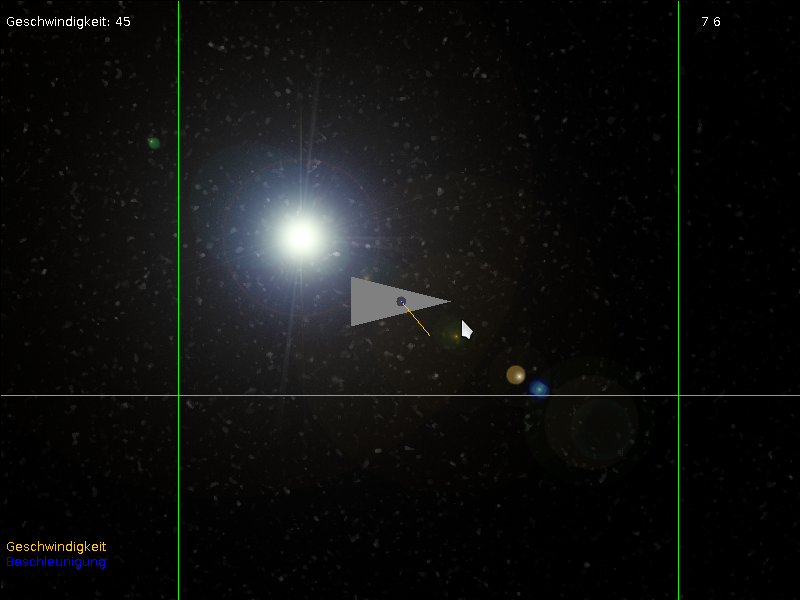

.. Copyright © 2014, 2016-2017 Martin Ueding <dev@martin-ueding.de>

######
quasar
######

One flies a space ship where velocity and acceleration vector are drawn in.
This somewhat illustrates 2D motion and demonstrates :math:`\vec x`,
:math:`\vec v` :math:`\vec a` from classical mechanics. The ship is steered
with the arrow keys.

I lost the source code to this and decompiled the only ``.jar`` file I had left
of this.

Download
========

Compiled version: `<quasar.jar>`_
